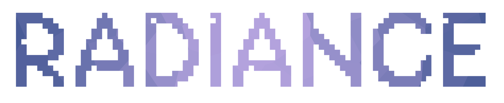

<div align="center">
  
  <p><b>Beautifully deterministic avatars for PHP</b></p>
</div>

<div align="center">
    <a href="https://www.php.net/">= 8.2" src="https://img.shields.io/badge/PHP-%E2%89%A5 8.2-777BB4?style=flat-square&logoColor=white&labelColor=111827&color=4f5b93&label=PHP"></a>
    <a href="https://packagist.org/packages/tomloprod/radiance"></a>
    <a href="https://github.com/tomloprod/radiance/actions"></a>
    <a href="https://packagist.org/packages/tomloprod/radiance"></a>
    <a href="https://packagist.org/packages/tomloprod/radiance"></a>
</div>

## ✨ **About Radiance**

**Radiance** is a modern PHP library designed to generate beautiful, deterministic mesh gradient avatars from any string. Same input always produces the same unique avatar, making it perfect for user profiles, identicons and more.

<div align="center">
  <video src="https://github.com/user-attachments/assets/447b9ffd-8ec6-4b37-9e0f-d48c12a86215" width="80%" controls></video>
  <p>👉 <a href="https://radiance.tomloprod.dev/" target="_blank">Try the interactive playground</a></p>
</div>

## 📑 **Features**

- 🎨 **Deterministic Generation**: Same seed, same avatar. Always.
- 🌈 **Mesh Gradients**: Smooth, vibrant, and perceptually balanced color transitions.
- 📐 **Multiple Shapes**: Circles, Squircles, and Rectangles.
- ⌨️ **Text Overlay**: Add initials or names with automatic font resizing and shadow effects.
- 🧩 **Pixel Patterns**: Optional identicon-style pixel overlays with customizable shapes and colors.
- ⚡ **Fluent API**: An intuitive and expressive interface.

## 🚀 **Installation**

Requires [PHP 8.2+](https://php.net/releases/).

Install Radiance via [Composer](https://getcomposer.org):

```bash
composer require tomloprod/radiance
```

---

## **✨ Usage**

### Basic Usage

Generate a simple avatar from a seed:

```php
$svg = radiance()
    ->seed('tomloprod')
    ->text('TL')
    ->toSvg();
```

### Advanced Customization

Radiance provides a fluent API to fully customize your avatars:

```php
$svg = radiance()
    ->seed('tomloprod')
    ->text('TL')
    ->size(256)
    ->squircle()
    ->baseColor('#3498db')
    ->saturation(1.5)
    ->contrast(1.2)
    ->toSvg();
```

### Pixel Patterns

Add a identicon-like pixelated overlay:

```php
$svg = radiance()
    ->seed('tomloprod')
    ->enablePixelPattern()
    ->pixelGridSize(8)
    ->pixelOpacity(0.4)
    ->pixelDensity(0.5)
    ->pixelShapeCircles()
    ->pixelColorAccent()
    ->toSvg();
```

### Text Controls

Fine-tune how text is displayed:

```php
$svg = radiance()
    ->seed('tomloprod')
    ->text('TL')
    ->fontFamily('Inter')
    ->fontSizeRatio(0.45)
    ->fontSizeRatioAuto(false)
    ->textShadow(0.8)
    ->toSvg();
```

---

## **🧱 API Reference**

### Base

| Method | Description | Default |
| :--- | :--- | :--- |
| `seed(string $seed)` | Set the deterministic seed. | `null` (random) |

### Shape & Size

| Method | Description | Default |
| :--- | :--- | :--- |
| `size(int $size)` | Set the dimension in pixels (width/height). | `512` |
| `circle()` | Set the shape to Circle. | - |
| `square()` | Set the shape to Square. | (Square) |
| `squircle()` | Set the shape to Squircle (rounded). | - |

### Colors

| Method | Description | Default |
| :--- | :--- | :--- |
| `baseColor(string $color)` | Influence the generated palette hue. Accepts hex, rgb, or hsl. | `null` |
| `solidColor(string $color)` | Use a fixed background instead of gradient. | `null` |

### Gradient Filters

| Method | Description | Default |
| :--- | :--- | :--- |
| `saturation(float $val)` | Adjust gradient saturation. 1.0 = original, >1 = vivid, <1 = muted. | `1.0` |
| `contrast(float $val)` | Adjust gradient contrast. 1.0 = original, >1 = higher contrast. | `1.0` |
| `fadeDistance(int $val)` | Control gradient circle size (40-200). Lower = colors more separated. | `50` |

### Text Overlay

| Method | Description | Default |
| :--- | :--- | :--- |
| `text(string $text)` | Add a centered text overlay. | `null` |
| `fontFamily(string $font)` | Set the font-family for the text. | `monospace` |
| `fontSizeRatio(float $ratio)` | Set font size as ratio of avatar size (0.01-1.0). Disables auto-sizing. | `0.5` |
| `fontSizeRatioAuto(bool $enabled)` | Enable/disable automatic font sizing based on text length. | `true` |
| `textShadow(float $val)` | Set text shadow intensity. 0 = no shadow. | `1.0` |

### Pixel Pattern

| Method | Description | Default |
| :--- | :--- | :--- |
| `enablePixelPattern(bool $enable)` | Enable/disable the identicon-style overlay. | `true` |
| `pixelGridSize(int $size)` | Set the pixel grid size (3, 5, 7...). Must be odd for symmetry. | `13` |
| `pixelOpacity(float $opacity)` | Set pixel pattern opacity (0.0-1.0). | `0.3` |
| `pixelDensity(float $density)` | Control how many pixels are drawn (0.0-1.0). | `0.25` |
| `pixelColorGradient()` | Use gradient-derived colors for pixels. | (Gradient) |
| `pixelColorMonochrome()` | Use white color for all pixels. | - |
| `pixelColorAccent()` | Use complementary accent color for pixels. | - |
| `pixelShapeSquares()` | Use square shapes for pixels. | (Squares) |
| `pixelShapeCircles()` | Use circle shapes for pixels. | - |
| `pixelShapeMix()` | Use mixed shapes (deterministic per seed). | - |

### Output

| Method | Description |
| :--- | :--- |
| `toSvg()` | Get the avatar as an SVG string. |
| `toBase64()` | Get the avatar as a Base64 encoded data URI. |

---

## **🧑‍🤝‍🧑 Contributing**

Contributions are welcome! Please review the [Contributing Guidelines](CONTRIBUTING.md) before submitting a pull request.

1. Fork the project.
2. Create a new branch (`git checkout -b feature/amazing-feature`).
3. Commit your changes (`git commit -m 'Add some feature'`).
4. Push to the branch (`git push origin feature/amazing-feature`).
5. Open a Pull Request.

## **📝 License**

**Radiance** is open-sourced software licensed under the [MIT license](LICENSE.md).

<div align="center">
    Created by <b><a href="https://github.com/tomloprod">Tomás López</a></b> • Powered by <b><a href="https://github.com/tomloprod/colority">Colority</a></b>
</div>
